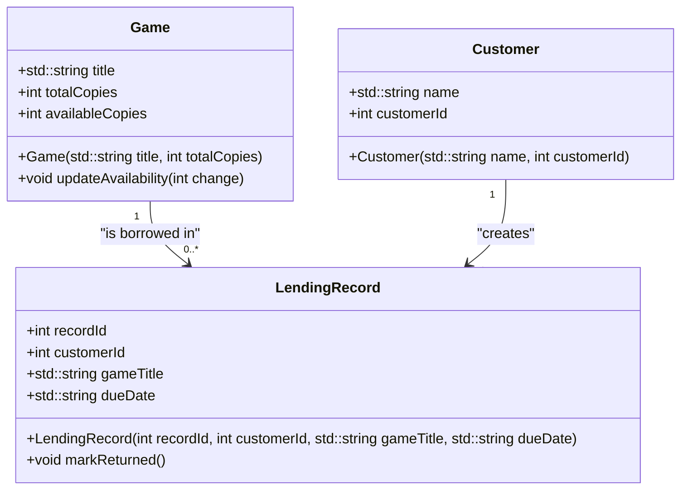

# Carter's Board Game Café Program!

## 1. Specification
This program is a lightweight way for the owner of this local board game café to do the following: 
- Maintain a catalog of board games, including the number of available copies.
- Track which customers have borrowed which games.
- Record when games are returned.

The program involves three main classes: `Game`, `Customer`, and `LendingRecord`. It lets the user list games, see which customers are borrowing the game, and track when the game is due and returned.

---

## 2. Nouns and Verbs

### Key Nouns
- **Game**: Represents a board game in the catalog.
- **Customer**: Represents a person borrowing a game.
- **LendingRecord**: Tracks which customer has borrowed which game and its due date.

### Key Verbs
- **List games**: Display all games and their availability.
- **Check out game**: Assign a game to a customer.
- **Return game**: Mark a game as returned.

---

## 3. Class Design

### Class: `Game`
```cpp
class Game {
public:
    std::string title;
    int totalCopies;
    int availableCopies;

    Game(std::string title, int totalCopies);
    void updateAvailability(int change);
};
```

### Class: `Customer`
```cpp
class Customer {
public:
    std::string name;
    int customerId;

    Customer(std::string name, int customerId);
};
```

### Class: `LendingRecord`
```cpp
class LendingRecord {
public:
    int recordId;
    int customerId;
    std::string gameTitle;
    std::string dueDate;

    LendingRecord(int recordId, int customerId, std::string gameTitle, std::string dueDate);
    void markReturned();
};
```

---

## 4. Class Diagram

