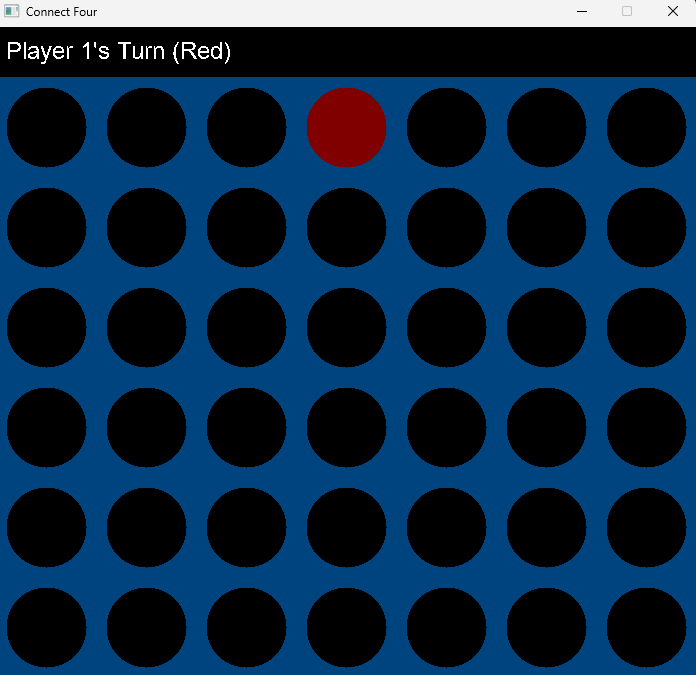

# Project 04 – Connect Four

## 🕹️ Description

This is a turn-based grid game written in C++ using SDL2. Players take turns placing pieces in a Connect Four-style game, aiming to align four tokens horizontally, vertically, or diagonally.

## 🎮 Controls

- Use arrow keys to select a column
- Press Enter to place a piece
- Press `R` to restart the game
- Press `Esc` to exit

## 🧪 Screenshot

## ✨ Extra Features

- Pre-highlighted piece drops
- Highlighting the current player's turn
- Designated exit button